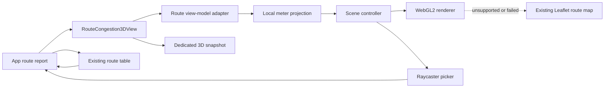
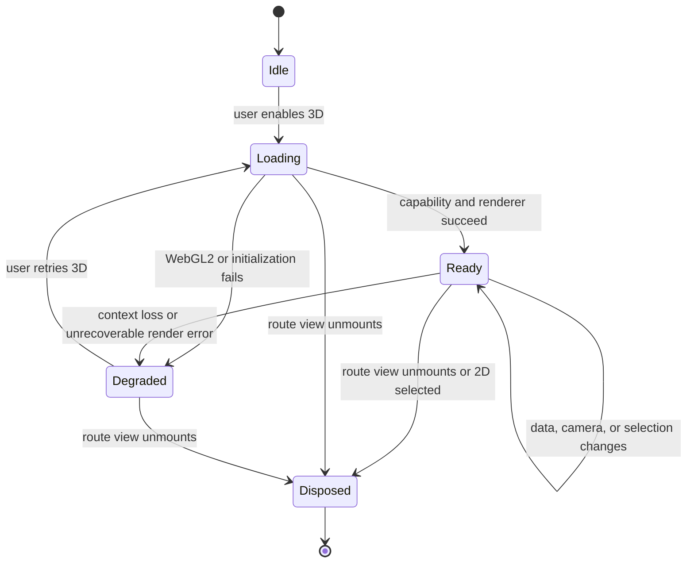

# Three.js Transit Visualization Pilot - Plan

> **For agentic workers:** REQUIRED SUB-SKILL: Use superpowers:subagent-driven-development (recommended) or superpowers:executing-plans to implement this plan task-by-task. Steps use checkbox (`- [ ]`) syntax for tracking.

**Goal:** 기존 2D 대중교통 분석 화면을 보존하면서, 노선 혼잡도 분석에 선택적으로 Three.js 기반 3D 시각화를 추가한다.

**Architecture:** 기존 `route-demand-view` 모델을 Three.js 전용 어댑터로 변환하고, 위경도를 로컬 미터 좌표로 투영한 뒤, 하나의 WebGL 렌더러와 명시적 리소스 수명주기를 갖는 장면으로 렌더링한다. React는 화면 전환·선택·접근성·fallback을 담당하고, Three.js는 장면과 상호작용만 담당한다.

**Tech Stack:** React 19, TypeScript, Vite/Electron renderer, `three@0.186.0` 고정, WebGL2 `WebGLRenderer`, `MapControls`, `Line2`/`LineMaterial`, `InstancedMesh`, `Raycaster`, 기존 Leaflet/ECharts/html2canvas 유지.

**Spec:** 본 계획은 앞서 검토한 선택적 Three.js 파일럿 결정을 구현 문서로 구체화한다. 기존 분석 계약은 `docs/OD_ANALYSIS.md`, Synthetic GTFS/MOTIS 연계 맥락은 `docs/superpowers/specs/2026-09-17-synthetic-gtfs-motis-integration-design.md`를 따른다.

## Global Constraints

- 기존 Leaflet 지도와 ECharts 차트의 기본 동작, 데이터 의미, 보고서 export를 변경하지 않는다.
- 첫 릴리스 범위는 `RouteCongestionMap`을 보완하는 노선 혼잡도 3D 파일럿 하나로 제한한다.
- Station demand 2.5D, OD 네트워크 3D, Synthetic GTFS/MOTIS 경로 애니메이션, 실제 도로망/지형 재현은 후속 범위다.
- Three.js는 초기 렌더러에 정적으로 포함하지 않고 노선 3D 화면을 열 때만 지연 로드한다.
- 위경도를 Three.js 월드 좌표로 직접 사용하지 않는다. 분석 범위 중심의 로컬 미터 투영을 사용한다.
- Three.js 객체를 `ProjectManifest`에 저장하지 않는다. 카메라·선택·표시 모드는 transient UI state로 유지한다.
- 기존 노선/구간 키와 혼잡도 색상 의미를 유지한다. 색상만으로 정보를 전달하지 않고 표·범례·상세 패널을 함께 제공한다.
- WebGL2 또는 GPU 초기화가 불가능하면 사용자가 이해할 수 있는 상태 메시지와 함께 기존 Leaflet 뷰를 계속 사용할 수 있어야 한다.
- 정적인 장면에는 지속적인 `requestAnimationFrame` 루프를 사용하지 않는다. 카메라·선택·데이터가 변할 때만 렌더링한다.
- renderer, scene, geometry, material, control, event listener를 명시적으로 해제한다. 동시에 유지하는 3D canvas는 하나로 제한한다.
- 구현 중인 worktree에는 기존 Synthetic GTFS/MOTIS 변경이 있으므로 해당 변경을 덮어쓰거나 범위를 넓히지 않는다.

---

## Goal Capsule

### Objective

분석자가 노선 혼잡도를 평면 선분 목록뿐 아니라 높이·두께·공간 배치로 탐색할 수 있는 보조 3D 뷰를 제공한다. 3D는 보고서 지도의 대체물이 아니라, 혼잡 구간을 빠르게 찾고 기존 표의 정밀 수치를 확인하도록 돕는 탐색 계층이다.

### Product value

- 피크 탑승량과 혼잡 구간의 공간적 패턴을 한눈에 파악한다.
- 3D 구간 선택과 기존 표 행 선택을 연결해 탐색 비용을 줄인다.
- GPU가 없는 환경에서도 기존 분석 기능을 잃지 않는다.
- 후속 Synthetic GTFS/MOTIS 시나리오 비교에 재사용 가능한 렌더링 경계를 만든다.

### Scope authority

현재 프로젝트의 Leaflet/ECharts 화면이 이미 유효한 2D 보고서 계약을 제공한다는 점과, Three.js는 3D 공간 탐색에서만 추가 가치가 있다는 검토 결과를 기준으로 한다. 선택적 추가 방식은 전체 지도 교체보다 현재 사용자 흐름과 export 호환성을 보존한다.

### Stop conditions

- 3D 파일럿이 기존 2D 화면의 초기 로드, 선택, export를 회귀시키면 3D 토글을 기본 비활성화한 상태로 중단하고 2D 경로만 유지한다.
- WebGL fallback과 리소스 해제가 신뢰성 있게 검증되지 않으면 후속 Synthetic GTFS/MOTIS 3D 확장으로 진행하지 않는다.
- 실제 도로망·지형 데이터가 필요해지는 요구는 이 계획의 범위를 넘어 별도 제품 검토로 분리한다.

---

## Product Contract

### Problem frame

현재 `src/renderer/RouteCongestionMap.tsx`는 노선 구간을 Leaflet 선분과 정류장 마커로 표시하고, `src/core/route-demand-view.ts`는 혼잡도·탑승량·선택 상태를 이미 계산한다. 이 계약을 다시 계산하거나 원시 `ProjectManifest`를 직접 렌더링하지 않고, 같은 구간 의미를 3D 공간 인코딩으로 보완한다.

### Requirements

#### R1 — 선택적 노선 혼잡도 3D 뷰

노선 분석 화면에서 사용자가 2D/3D 표시를 전환할 수 있어야 한다. 2D가 기본값이고, 유효한 노선 구간·정류장 좌표가 있을 때만 3D를 활성화한다.

#### R2 — 기존 분석 의미의 보존

3D 모델은 기존 `RouteSegmentMetric`과 route view model에서 생성한다.

- X/Y: 중심점 기준 로컬 미터 좌표.
- Z: 구간의 `peakOnboard` 또는 선택된 혼잡 지표를 정규화한 높이.
- 선 두께/불투명도: 기존 피크 탑승량·혼잡도 강조 규칙을 보조적으로 반영.
- 색상: 기존 혼잡도 band를 유지하며, null·계산 불가 값은 중립색으로 표시.
- 구간 키·방향·정류장 순서: 기존 표와 동일하게 유지.

#### R3 — 3D 탐색과 표 선택 동기화

카메라 이동·확대/축소가 가능해야 하며, 3D 선분 또는 정류장 선택은 기존 선택 상태와 연결되어야 한다. 기존 표는 전체 구간의 키보드 접근 가능한 선택 surface이자 3D 상세 정보의 보조 surface로 유지한다.

#### R4 — 안전한 renderer 수명주기

화면 진입 시 필요한 renderer만 만들고, 노선·필터·표시 모드 변경 시 장면을 갱신하며, 화면 이탈 시 GPU 리소스와 이벤트를 해제한다. 반복 mount/unmount에도 renderer나 geometry가 누적되지 않아야 한다.

#### R5 — GPU·WebGL fallback

WebGL2 미지원, context 생성 실패, context loss, Three.js 초기화 실패를 구분 가능한 상태로 처리한다. 실패 시 기존 Leaflet 혼잡도 지도로 자동 복귀하거나 사용자가 다시 선택할 수 있어야 하며, 분석 표 데이터는 계속 제공한다.

#### R6 — 보고서 및 캡처 호환

기존 PNG/PDF/XLSX 보고서 흐름은 2D 화면 기준으로 변함없이 동작한다. 3D 파일럿은 별도의 사용자 주도 snapshot 경로를 제공할 수 있어야 하며, WebGL canvas의 기본 drawing-buffer 동작에 의존해 기존 `html2canvas` export를 우연히 통과시키지 않는다.

#### R7 — 데이터·영속성 경계

새 3D 장면 객체·GPU 상태·카메라 행렬을 manifest나 분석 결과 파일에 저장하지 않는다. 저장이 필요한 분석 결과는 기존 `ProjectManifest`, `RouteCongestionResult`, `scenarioDeltas` 계약을 그대로 사용한다.

#### R8 — 기존 기능 무회귀

weekday/hourly 차트, station/OD 분석, 품질 화면, Leaflet 지도, 선택 동기화, Windows 패키징의 현재 동작을 보존한다. 3D 코드가 해당 화면의 초기 bundle과 런타임 비용을 증가시키지 않아야 한다.

### Acceptance examples

- **AE1:** 유효한 route fixture를 연 뒤 3D를 선택하면 기존 구간 수·정류장 순서·혼잡도 band와 일치하는 선분/마커가 표시된다.
- **AE2:** 기존 표의 행을 선택하면 같은 `segmentKey`가 3D에서 강조되고, 3D 구간을 선택하면 표의 해당 행과 상세 정보가 갱신된다.
- **AE3:** 좌표가 없는 구간, null 혼잡도, 0에 가까운 정규화 범위가 있어도 화면이 중단되지 않고 중립색·제외·안내 상태로 처리된다.
- **AE4:** WebGL2를 사용할 수 없는 환경에서는 명확한 안내 후 Leaflet 지도가 표시되고, 표·export는 계속 사용할 수 있다.
- **AE5:** 같은 화면을 반복해서 열고 닫거나 노선/필터를 바꾸어도 10회 이상 cycle 후 GPU resource count가 baseline으로 돌아온다.
- **AE6:** 3D snapshot은 현재 카메라·선택·범례 상태를 재현하고, 기존 2D PNG/PDF/PDF report export는 회귀하지 않는다.
- **AE7:** reverse direction, 정류장 1개, 구간 0개, 비정상 좌표 같은 경계 입력이 예외 없이 처리된다.

---

## Planning Contract

### Key technical decisions

- **KTD1 — 전체 교체가 아닌 선택적 추가:** 기존 Leaflet/ECharts를 유지하고 Route Congestion 3D를 파일럿으로 추가한다. 이는 이미 안정된 2D 보고서 surface를 보존하면서 Three.js가 실제로 추가 가치를 주는 공간 탐색만 검증하기 위한 선택이다. (session-settled: user-approved — 선택적 파일럿 범위를 전제로 구현계획 작성을 요청함.)
- **KTD2 — vanilla Three.js 경계:** React Three Fiber 같은 추가 추상화 대신 현재 Leaflet 컴포넌트와 같은 imperative `useEffect`/`useRef` 패턴으로 renderer 수명주기를 소유한다. 현재 앱의 지도 구현과 맞고, 첫 파일럿에서 React scene graph와 GPU resource ownership을 동시에 도입하지 않아도 된다.
- **KTD3 — WebGL2 우선, WebGPU 보류:** `WebGLRenderer`와 WebGL용 wide-line 구현을 먼저 사용한다. WebGPU backend와 Node material wide-line은 호환성·지원 범위를 별도 검증한 뒤 후속 결정으로 남긴다.
- **KTD4 — 기존 view model 재사용:** `RouteSegmentMetric`/`route-demand-view`가 계산한 검증된 의미를 `Transit3DModel`로 변환한다. `ProjectManifest` 직접 접근을 피하면 원시 데이터 결합과 2D/3D 의미 불일치가 줄어든다.
- **KTD5 — 로컬 미터 투영:** 위경도 degree를 월드 좌표로 쓰지 않고 분석 범위 중심의 동-북 로컬 좌표로 바꾼다. 그래야 카메라 scale, 선 폭, 높이, 거리 기반 제어가 일관된다.
- **KTD6 — render-on-demand:** static route scene은 장면 변경 시에만 렌더링하고, 지속 애니메이션은 후속 path playback에서만 도입한다. Electron renderer의 idle 비용과 GPU 사용량을 낮추기 위한 선택이다.
- **KTD7 — DOM 기반 접근성 보존:** WebGL canvas는 시각적 탐색 surface이고, 기존 표·범례·상세 패널은 키보드와 보조기술이 접근하는 정본 surface로 남긴다. CSS/HTML 3D label을 핵심 수치 전달 수단으로 사용하지 않는다.
- **KTD8 — 전용 snapshot 경로:** 현재 report DOM 캡처에 WebGL canvas가 우연히 포함되기를 기대하지 않고, 3D canvas의 사용자 주도 캡처를 별도 책임으로 둔다. renderer의 drawing-buffer 기본값과 report export를 분리하기 위한 결정이다.

### Assumptions

- 이 계획은 2026-09-18 기준 Three.js 최신 확인 버전 `0.186.0`을 exact version으로 고정하는 것을 전제로 한다.
- 현재 저장소에는 renderer 전용 DOM/WebGL 테스트 harness가 없으므로, 순수 변환·수명주기 경계는 Vitest로 검증하고 실제 GPU 상호작용은 Electron smoke/performance 검증으로 보완한다.
- 기존 worktree의 Synthetic GTFS/MOTIS 변경은 3D 파일럿의 입력 데이터 확장 가능성을 제공하지만, 이번 구현에서 해당 sidecar나 manifest schema를 수정할 필요는 없다.
- 기준 성능은 Windows 개발 기준 머신에서 측정한다. GPU 차이가 크므로 절대 FPS보다 초기 bundle, interaction latency, resource cleanup을 우선 gate로 삼는다.

### Deferred to implementation

- 정확한 UI 문구와 토글 위치는 현재 route report layout에 맞춰 결정하되, 2D 기본값·fallback·선택 동기화 계약은 변경하지 않는다.
- `RouteSegmentMetric`의 여러 수치 중 기본 Z encoding은 `peakOnboard`를 우선하고, 데이터가 없거나 사용자가 다른 지표를 고를 필요가 확인될 때만 별도 selector를 추가한다.
- 실제 Electron GPU 조합별 threshold와 snapshot 배경색은 기준 머신에서 측정 후 문서화한다. 이 항목은 제품 범위를 바꾸지 않는 구현 세부사항이다.

---

## High-Level Technical Design

### Component and data flow

The adapter accepts only the typed route view model and emits stable segment/stop identifiers, projected coordinates, normalized visual values, and display metadata. The scene controller owns Three.js resources but does not own application selection state. React owns the selected key and passes it back into the scene on update.

### Lifecycle and failure states

`Degraded` keeps the analytical table and 2D fallback usable. `Disposed` is terminal for that controller instance; a later retry creates a fresh instance instead of attempting to reuse partially released GPU state.

### Visual encoding rules

| Source value | 3D encoding | Required guard |
|---|---|---|
| Segment geometry | projected polyline or straight analytic segment | invalid/missing coordinates are excluded from geometry but remain explainable in the table |
| `congestionPercent` band | segment color and legend label | null/NaN uses neutral color and never enters a color scale as zero |
| `peakOnboard` | normalized Z height and optional marker scale | all-equal values use a stable minimum height; no division by zero |
| selection key | selected material/color/outline state | selection is keyed by existing segment identifier, never by array index |
| station coordinate | instanced marker position | duplicate coordinates remain distinct by station/sequence key |

---

## Implementation Units

### U1 — Add the dependency and capability boundary

- [ ] **Goal:** Three.js를 기존 renderer에 안전하게 추가하고, WebGL2 capability/fallback 판단을 순수한 경계로 분리한다.
- **Requirements:** R4, R5, R8.
- **Dependencies:** 없음. U2–U5의 기반.
- **Files:**
  - Modify `package.json` and the lockfile with exact `three@0.186.0`.
  - Create `src/renderer/three/capabilities.ts` for capability probing and failure classification.
  - Create `src/renderer/three/types.ts` for renderer-neutral 3D model/state types.
  - Add focused tests under `tests/renderer/three/capabilities.test.ts`.
- **Approach:**
  - Keep the Three.js import behind the route 3D feature boundary; importing the app shell must not instantiate a renderer.
  - Make capability probing injectable/pure enough to test supported, missing, throwing, and context-loss-like conditions without a real GPU.
  - Define explicit states for idle, loading, ready, degraded, and disposed so React does not infer failure from a blank canvas.
  - Keep types free of Three.js object references; resource ownership stays in the scene layer.
- **Test scenarios:**
  - A supported WebGL2 probe returns an enabled state and does not mutate application data.
  - Missing browser globals, a null context, a throwing context probe, and an initialization error each produce a recoverable degraded state.
  - Loading the route report without enabling 3D does not import or construct a renderer.
- **Verification:** package/lockfile consistency, typecheck, and focused capability tests; verify the route report still starts through its current 2D path.

### U2 — Build the route model adapter and local projection

- [ ] **Goal:** 기존 route view model을 Three.js가 소비할 수 있는 안정적인 로컬 좌표 모델로 변환한다.
- **Requirements:** R2, R7; supports AE1, AE3, AE7.
- **Dependencies:** U1 types.
- **Files:**
  - Create `src/renderer/three/model.ts` for route segment/stop visual model creation.
  - Create `src/renderer/three/projection.ts` for bounds/centroid-based local meter projection.
  - Add `tests/renderer/three/model.test.ts` and `tests/renderer/three/projection.test.ts`.
- **Approach:**
  - Consume the same route view data used by `src/renderer/RouteCongestionMap.tsx` and `src/core/route-demand-view.ts`; do not duplicate congestion classification.
  - Preserve route direction, station sequence, segment key, and original metric references as non-rendering metadata.
  - Project longitude to local east and latitude to local north using a stable reference latitude/centroid, with a deterministic fallback for degenerate extents.
  - Normalize height and optional width values with explicit lower/upper bounds. Missing and invalid metrics remain distinguishable from zero.
  - Return diagnostics for omitted coordinates so the UI can expose a non-blocking count rather than silently losing data.
- **Test scenarios:**
  - A normal route produces monotonic projected station order and stable segment keys.
  - Reverse direction keeps its source order and selection identity.
  - Identical or near-identical coordinates do not produce NaN/Infinity or a collapsed camera range.
  - Null congestion is neutral, zero peak onboard is not treated as missing, and all-equal peak values still produce visible but bounded heights.
  - Missing endpoint coordinates omit only the affected geometry and report diagnostics.
  - A one-station and zero-segment route returns a valid empty/marker-only model.
- **Verification:** deterministic fixture assertions, comparison against the existing route map’s segment count/keys, and no changes to persisted project/result types.

### U3 — Implement the scene controller and resource lifecycle

- [ ] **Goal:** projected model을 선분·정류장·범례 상태가 있는 하나의 효율적인 WebGL 장면으로 렌더링한다.
- **Requirements:** R2, R3, R4; supports AE1, AE2, AE5.
- **Dependencies:** U1 types/capability, U2 model/projection.
- **Files:**
  - Create `src/renderer/three/scene.ts` for renderer/camera/scene ownership and render-on-demand scheduling.
  - Create `src/renderer/three/layers.ts` for route segment and station layers.
  - Create `src/renderer/three/interaction.ts` for camera controls and picking state translation.
  - Add focused tests under `tests/renderer/three/scene.test.ts` for resource ownership and model-to-layer contracts.
- **Approach:**
  - Use a single renderer/camera/scene per active 3D view. Use bird’s-eye `MapControls` semantics for route-map navigation.
  - Render route segments with WebGL wide-line primitives where available in the pinned Three.js version; keep a thin-line fallback within the same scene if wide-line setup fails.
  - Use shared geometry/material groups and `InstancedMesh` for repeated station markers so object count and draw calls do not scale one-to-one with markers.
  - Store stable segment/station identifiers in pickable metadata and translate Raycaster intersections, including instance identity, back to application keys.
  - Render only on initial scene creation, resize, camera change, data update, and selection update. Avoid a permanent animation loop for the static pilot.
  - Keep labels and detailed values in React DOM; the scene only supplies visual highlights and pick targets.
  - Make disposal cover renderer, controls, event listeners, geometries, materials, and any generated textures before canvas removal.
- **Test scenarios:**
  - A route model creates the expected segment and station layers with band colors and bounded heights.
  - Updating selection changes the visual state for the matching key without changing metric data or rebuilding unrelated layers.
  - Picking a segment returns its stable key; picking an instanced station returns its station/sequence key.
  - Resize and camera updates request a render, while unchanged static state does not schedule an unbounded loop.
  - Dispose is idempotent and releases all owned resources; a second dispose does not throw.
  - Layer creation failure produces a recoverable error for U4 instead of leaving a partially interactive canvas.
- **Verification:** mocked renderer/resource tests, `renderer.info` inspection in Electron, and repeated mount/unmount profiling on a Windows reference machine.

### U4 — Integrate the 3D view with React, table selection, and fallback

- [ ] **Goal:** 사용자가 기존 route report 안에서 2D/3D를 안전하게 전환하고 양방향 선택 동기화를 사용하도록 한다.
- **Requirements:** R1, R3, R5, R8; supports AE1, AE2, AE4, AE7.
- **Dependencies:** U1–U3.
- **Files:**
  - Create `src/renderer/RouteCongestion3DView.tsx` as the React boundary for the scene controller.
  - Modify `src/renderer/App.tsx` to add the route-view toggle, selected-key wiring, status/fallback state, and existing table integration.
  - Modify `src/renderer/styles.css` for canvas sizing, status message, legend, focus state, and responsive layout.
  - Add renderer contract tests under `tests/renderer/route-congestion-3d.test.ts`; use the smallest DOM harness needed by the repository’s current test setup.
- **Approach:**
  - Keep 2D selected by default. Mount the 3D component only after an explicit user choice and unmount it when switching back to 2D.
  - Pass the existing selected segment identity down; scene picks call the same selection path that table/map selection already uses.
  - Keep the table, metrics, and legend visible or discoverable beside the canvas. Add clear status for loading, unsupported WebGL, initialization error, and omitted-coordinate diagnostics.
  - When 3D fails, preserve the current route result and show the existing Leaflet map as the primary fallback. Retrying should create a fresh scene controller.
  - Handle route changes, direction changes, empty results, and resize without stale scene data or stale selected keys.
- **Test scenarios:**
  - Route report opens with 2D and no Three.js initialization; toggling to 3D loads the view once.
  - Table selection highlights the corresponding 3D segment, and a 3D pick updates table selection and detail content.
  - Switching route/direction clears stale geometry and maps selection only to valid keys.
  - Empty result, no-coordinate result, unsupported WebGL, and initialization failure show usable UI and preserve Leaflet/table access.
  - Keyboard focus and table selection remain usable without pointer interaction on the canvas.
- **Verification:** renderer contract tests plus Electron manual smoke for route tab, toggle, selection, fallback, resize, and return to 2D; confirm non-route tabs have unchanged behavior.

### U5 — Add dedicated 3D snapshot and accessibility-safe presentation

- [ ] **Goal:** 3D 장면을 사용자가 재현 가능한 이미지로 저장할 수 있게 하되 기존 보고서 export와 분리한다.
- **Requirements:** R6, R8; supports AE6.
- **Dependencies:** U3 scene ownership, U4 UI boundary.
- **Files:**
  - Create `src/renderer/three/capture.ts` for explicit canvas/snapshot capture coordination.
  - Modify `src/renderer/RouteCongestion3DView.tsx`, `src/renderer/App.tsx`, and `src/renderer/styles.css` for the snapshot affordance and error state.
  - Add `tests/renderer/three/capture.test.ts` for capture state/error contracts.
- **Approach:**
  - Capture only on user request after forcing a current render; do not globally change the renderer’s drawing-buffer policy to make the existing DOM export pass.
  - Keep 2D PNG/PDF/XLSX export unchanged and explicitly label the 3D action as a view snapshot rather than a full report export.
  - Provide text equivalents through the existing route table and metric detail; canvas labels are supplementary and not the only way to discover values.
  - Respect reduced-motion preferences by keeping the pilot static and avoid tooltip-only critical information.
- **Test scenarios:**
  - Snapshot uses the current camera, selected key, legend, and background state after a deterministic render.
  - Capture failure leaves the route view usable and reports a recoverable message.
  - Existing report export remains available and produces the same 2D content when 3D is selected or not selected.
  - Keyboard users can reach the snapshot action and the table-based equivalent without requiring canvas picking.
- **Verification:** compare 3D snapshot output with an on-screen state, verify existing export flows, and manually inspect focus/contrast at the route report viewport sizes.

### U6 — Validate performance, packaging, fallback, and documentation

- [ ] **Goal:** 파일럿을 Windows Electron 환경에서 운영 가능한 상태로 검증하고 사용·지원 문서를 남긴다.
- **Requirements:** R4, R5, R8; closes AE4–AE6.
- **Dependencies:** U1–U5.
- **Files:**
  - Create `tests/renderer/three/benchmark-fixture.test.ts` for deterministic scaled route fixtures and normalization limits.
  - Create `docs/THREE_VISUALIZATION.md` with usage, visual encoding, fallback behavior, known limitations, and troubleshooting.
  - Modify `README.md` to mention the optional route 3D pilot and that 2D remains the report baseline.
  - Add a benchmark record under `docs/benchmarks/` only after the reference-machine run; do not overwrite existing benchmark artifacts.
- **Approach:**
  - Exercise a normal fixture and scaled synthetic fixtures representing approximately 1,000 segments and 5,000 stops; preserve the real fixture as the semantic correctness case.
  - Inspect startup bundle behavior to confirm Three.js is absent from non-3D flows until the toggle is used.
  - Inspect Electron GPU feature status and reproduce unsupported/context-loss paths where practical; document environment-specific results.
  - Repeat route changes and mount/unmount cycles while observing `renderer.info.memory` and active canvas count.
  - Document that the pilot is analytic geometry, not road-following geometry, and that Leaflet remains the source for geographic context and report export.
- **Test scenarios:**
  - Scaled fixtures remain finite, deterministic, and within the layer’s intended object/draw-call strategy.
  - 3D lazy loading does not change home, weekday/hourly, station, OD, quality, or 2D route startup behavior.
  - Ten or more enter/exit/filter cycles return GPU memory counters to the pre-view baseline within the measurement noise of the reference machine.
  - A reference Windows package starts, opens the route report, toggles 3D, falls back, returns to 2D, and exports a report.
- **Verification:** existing unit suite and typecheck, production build, Windows packaging smoke, benchmark record, and documentation review against the requirements/acceptance matrix.

---

## System-Wide Impact

### Runtime and entry points

- `src/renderer/App.tsx` gains a route-only display mode and selection bridge; all other report tabs keep their current render path.
- `src/renderer/RouteCongestion3DView.tsx` becomes the only React component allowed to create the 3D controller.
- `src/renderer/three/*` owns GPU resources, projection, picking, and capture helpers but must not mutate `ProjectManifest` or core analysis results.
- `src/main/index.ts` and preload contracts should remain unchanged unless implementation proves that a read-only GPU diagnostic is required; a renderer-only fallback is preferred.

### Data flow and state

Raw transaction/route data → existing core analysis → existing route view model → typed 3D adapter → projected visual model → scene resources. Selection flows in the opposite direction only through stable route/station keys. Camera state, renderer state, diagnostics, and snapshot state are ephemeral and are discarded on unmount.

### Performance and memory

The primary new cost is GPU context creation and scene memory. Lazy loading limits bundle impact; instancing/shared materials limit draw calls; render-on-demand limits idle work; explicit disposal prevents cumulative GPU leaks. Performance evidence must include both initial 2D route load and active 3D interaction.

### Export and reporting

The current `html2canvas`-based report path is a compatibility surface and remains 2D-first. Three.js snapshot is a separate action and must not make report export depend on WebGL support. PDF/XLSX output remains analytical data/report output rather than a 3D scene serialization.

### Accessibility and support

The canvas cannot be the only interaction or source of values. Existing route table, legend text, selected-row styling, and detail metrics remain available. Support documentation must explain GPU fallback, analytic geometry limits, and how to read the same values from the table.

### Packaging and security

No new network or remote asset is required by the pilot. Existing Leaflet tile behavior is unchanged. Three.js is bundled as a local dependency and must not receive raw HTML, arbitrary URLs, or unvalidated project data as executable content.

---

## Risks and Dependencies

| ID | Risk/dependency | Impact | Mitigation and verification |
|---|---|---|---|
| D1 | WebGL2/GPU driver unavailable or context loss | 3D unavailable or blank | Capability probe, explicit degraded state, Leaflet fallback, Electron GPU status check |
| D2 | GPU resources leak across React lifecycle | memory growth, later renderer failure | single owner, idempotent disposal, `renderer.info` before/after repeated cycles |
| D3 | 3D height/width exaggerates analytical meaning | misleading interpretation | bounded normalization, visible legend, exact table values, analytic-geometry disclaimer |
| D4 | Wide-line implementation differs across renderer backends | inconsistent line appearance | pin Three.js, use WebGL path first, keep thin-line fallback, defer WebGPU |
| D5 | DOM capture misses or corrupts WebGL canvas | incomplete report image | dedicated 3D snapshot, 2D report export regression test |
| D6 | Large route data increases draw calls or pick cost | interaction latency | shared materials, `InstancedMesh` for repeated markers, scaled fixtures, profiling gate |
| D7 | Current worktree has unrelated in-progress MOTIS changes | merge/conflict or accidental scope expansion | limit touched files, preserve existing changes, verify against current baseline before implementation |
| D8 | Camera/navigation is unfamiliar to report users | reduced discoverability | bird’s-eye map controls, reset affordance, 2D default, table-driven selection |

### External dependencies

- The exact Three.js version and lockfile must remain aligned.
- Electron’s actual WebGL2/GPU status is environment-dependent and must be measured on the supported Windows reference machine.
- No external map/terrain/road-network provider is a dependency of the pilot.

---

## Verification Contract

### Automated gates

| Gate | Scope | Observable proof | Requirements |
|---|---|---|---|
| V1 | Core and renderer-neutral unit behavior | model/projection/capability/capture tests pass; all outputs remain finite and keyed | R2, R4, R5, R7 |
| V2 | Type and bundle integrity | `npm run typecheck` and `npm run build` pass; non-3D routes do not initialize Three.js | R1, R5, R8 |
| V3 | Existing regression suite | current baseline of 22 files/142 tests remains green, plus new focused tests | R6, R8 |
| V4 | Windows packaging | `npm run package:win` completes and packaged app opens the route report | R5, R8 |

### Electron smoke matrix

- Route report: 2D default → 3D load → camera pan/zoom → table selection → 3D selection → 2D return.
- Data edges: empty route, missing coordinates, null congestion, one station, reverse direction.
- Failure edges: WebGL2 unavailable, renderer initialization error, context loss/retry where reproducible.
- Export: 2D PNG/PDF/XLSX before and after 3D toggle; 3D snapshot with selected and unselected states.
- Regression tabs: weekday/hourly, station, OD, quality, and their current exports.

### Performance gates

- The 3D dependency is not loaded on application startup or on non-3D route flows.
- On the reference Windows machine, the scaled fixture remains interactable during camera movement and selection; record p95 frame time and interaction latency rather than relying on a visual impression.
- After at least 10 mount/unmount and filter cycles, active canvas count is one when 3D is open and zero after leaving it; owned geometry/material/texture counters return to baseline within measurement noise.
- Any failed gate blocks expansion to station/OD/Synthetic GTFS/MOTIS 3D and is recorded with environment details.

### Traceability

| Requirement | Implementing units | Primary proof |
|---|---|---|
| R1 | U1, U4 | 2D default and explicit toggle smoke |
| R2 | U2, U3 | model/projection tests and visual encoding comparison |
| R3 | U3, U4, U5 | bidirectional selection and keyboard/table smoke |
| R4 | U1, U3, U6 | lifecycle tests and resource profiling |
| R5 | U1, U4, U6 | capability/error/fallback matrix |
| R6 | U5, U6 | 3D snapshot plus unchanged report export |
| R7 | U1, U2, U4 | no manifest/schema mutation and typed model tests |
| R8 | U4, U5, U6 | full regression, build, packaging, and tab matrix |

---

## Documentation and Operational Notes

- `docs/THREE_VISUALIZATION.md` should explain how to enable the pilot, the meaning of color/height/selection, fallback behavior, snapshot semantics, supported limitations, and common GPU troubleshooting.
- `README.md` should describe the pilot as optional and experimental relative to the existing 2D report baseline.
- The benchmark record should include OS, Electron version, GPU status, fixture size, active canvas count, renderer memory before/after, p95 frame time, and known deviations.
- Do not add a road-network or terrain screenshot as a product promise. The pilot uses analytic route geometry unless a separate data and licensing decision is approved.
- After implementation, a focused visual review should inspect contrast, selected-state clarity, camera reset/discoverability, responsive layout, and fallback copy at the existing 1440×1000 window and a smaller supported window.

---

## Definition of Done

- [ ] U1–U6 are implemented without overwriting unrelated worktree changes.
- [ ] Requirements R1–R8 and acceptance examples AE1–AE7 are demonstrated or explicitly blocked by a recorded environment limitation.
- [ ] 2D Leaflet maps, ECharts charts, table selection, and PNG/PDF/XLSX exports retain their current behavior.
- [ ] 3D is lazy-loaded, WebGL2-gated, single-canvas, render-on-demand, and explicitly disposed.
- [ ] Missing/invalid data, initialization errors, context loss, and unsupported GPU paths remain usable through table + Leaflet fallback.
- [ ] 3D/table selection identity is stable across route direction and filter changes.
- [ ] Focused tests, existing regression tests, typecheck, production build, Windows packaging smoke, and performance/lifecycle checks pass.
- [ ] User and support documentation describes the pilot’s analytic geometry, accessibility path, snapshot semantics, and fallback behavior.
- [ ] No Three.js-specific runtime state is persisted into `ProjectManifest` or other existing result schemas.

---

## Sources and Research

### Repository evidence

- `README.md` — current Windows Electron product surface, Leaflet/ECharts usage, and export contract.
- `src/renderer/ODDemandMap.tsx`, `src/renderer/StationDemandMap.tsx`, `src/renderer/RouteCongestionMap.tsx` — imperative map lifecycle and selection patterns to preserve.
- `src/core/od-demand-view.ts`, `src/core/route-demand-view.ts` — existing typed visual view models and stable flow/segment semantics.
- `src/shared/types.ts` — station, route, segment metric, analysis result, and project manifest boundaries.
- `docs/OD_ANALYSIS.md` — current map behavior and its analytic/static geometry limitations.
- `docs/superpowers/specs/2026-09-17-synthetic-gtfs-motis-integration-design.md` — future scenario/provenance context; this plan intentionally does not expand its schema.
- Baseline verification before planning: `npm test` passed 22 files/142 tests; `npm run typecheck` passed.

### External research

- [Three.js npm package](https://www.npmjs.com/package/three) — current package/version and MIT dependency posture checked 2026-09-18.
- [WebGLRenderer](https://threejs.org/docs/pages/WebGLRenderer.html) — WebGL2 renderer, resize/pixel-ratio handling, render statistics, and explicit disposal considerations.
- [WebGPURenderer](https://threejs.org/docs/pages/WebGPURenderer.html) — backend/fallback behavior informing the decision to defer WebGPU.
- [InstancedMesh](https://threejs.org/docs/pages/InstancedMesh.html) — draw-call reduction and instance update/disposal behavior for repeated markers.
- [MapControls](https://threejs.org/docs/pages/MapControls.html) and [Raycaster](https://threejs.org/docs/pages/Raycaster.html) — map-like navigation and pointer picking, including instance identity.
- [Line2](https://threejs.org/docs/pages/Line2.html) and [LineMaterial](https://threejs.org/docs/pages/LineMaterial.html) — WebGL wide-line constraints that motivate the WebGL-first pilot.
- [CSS2DRenderer](https://threejs.org/docs/pages/CSS2DRenderer.html) — limitations that support keeping critical labels/details in React DOM.
- [Electron performance guidance](https://www.electronjs.org/docs/latest/tutorial/performance) — profiling, deferred loading, and renderer performance considerations.
- [Electron GPU feature status](https://www.electronjs.org/docs/latest/api/structures/gpu-feature-status/) — environment-level WebGL/WebGL2 status values for fallback diagnostics.

### Research-to-plan synthesis

The repository already has the analytical data and selection contracts needed for a focused 3D layer, while the official Three.js/Electron references emphasize explicit renderer lifecycle, draw-call control, capability detection, and profiling. Those findings directly drive KTD2–KTD8, U1–U6, and verification gates V1–V4; they do not justify replacing the existing 2D maps or introducing a road/terrain provider in this phase.
