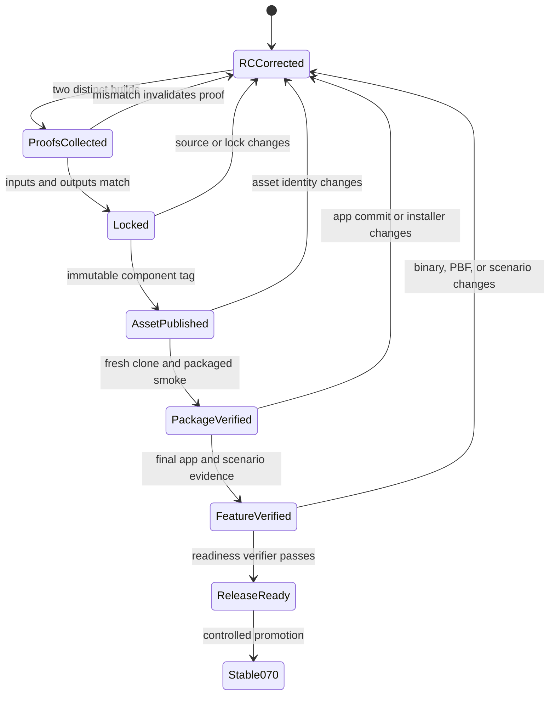

# Correct 0.7.0 Release Readiness - Plan

## Goal Capsule

- Correct the current stable-looking 0.7.0 state to `0.7.0-rc.1` without removing the integrated source from `main`.
- Remove the premature `v0.7.0` tag and any matching GitHub Release object after inventorying it.
- Make stable promotion fail closed until two independent Custom MOTIS builds, lock and attestation, immutable asset publication, fresh-clone packaging, and final integrated feature validation all refer to the same immutable inputs.
- Keep `v0.6.2` as the previously published source checkpoint, but never use that historical tag as the provenance anchor for a later Custom MOTIS binary.
- Stop after the RC correction and enforceable gates are shipped if external build or validation evidence is unavailable. A stable `v0.7.0` tag is outside the correction step and may be created only after every gate passes.

---

## Product Contract

### Summary

The repository currently presents `b0316a2` as final 0.7.0 even though its Custom MOTIS builder lock is `probe`, the release archive hash is unset, the required attestation is absent, and final packaged feature validation has not run. The correction preserves the integrated code on `main`, identifies it as `0.7.0-rc.1`, removes the premature stable tag, and installs machine-verifiable gates that make the eventual stable promotion an evidence-backed operation.

### Problem Frame

Documentation described missing release work but package metadata, changelog wording, commit wording, and the `v0.7.0` tag still asserted completion. The existing MOTIS publish workflow validates part of the component pipeline but can accept an arbitrary release tag, and the current two-proof implementation cannot prove two independent builds because observations carry no immutable run identity while the lock code rejects different run IDs. Historical validation reports also use different binaries and PBFs, so they cannot be combined into one final evidence chain.

### Requirements

#### Immediate correction

- R1. `main` must retain the integrated feature source while package metadata and public documentation identify the current app as `0.7.0-rc.1`.
- R2. The local and remote `v0.7.0` tag must be removed, and a matching GitHub Release object must be inventoried and removed if it exists.
- R3. The corrective commit must be tagged `v0.7.0-rc.1` only after tests and build pass.

#### Evidence integrity

- R4. Two build proofs must carry distinct immutable workflow run identities and verified GitHub artifact provenance while matching source, patch, toolchain, build parameters, binary hash, and deterministic payload/archive hashes.
- R5. Candidate validation, builder lock, published asset, package smoke, and feature validation must be cryptographically bound to their exact source, app commit/version, Custom MOTIS binary, archive, PBF, and reports.
- R6. Existing historical reports with different binary or PBF hashes must remain historical evidence and must not satisfy final readiness.

#### Promotion safety

- R7. A single release-readiness verifier must reject stable promotion when any required evidence is missing, mismatched, stale, prerelease-only, or still in `probe` state.
- R8. The Custom MOTIS publish workflow must derive or verify its component tag and refuse to create an absent or conflicting tag.
- R9. The app stable release workflow must be the repository-owned promotion path and may create `v0.7.0` only after the readiness verifier succeeds for the exact target commit.
- R10. Repository documentation must distinguish the Custom MOTIS component release from the app release and define evidence invalidation when source, binary, PBF, lock, installer, or app commit changes.
- R11. A remote tag ruleset must block direct stable app-tag creation outside the controlled promotion actor, and its effective configuration must be read back before promotion.

### Acceptance Examples

- AE1. Given the current `probe` lock and missing evidence, running the stable readiness verifier for `0.7.0` fails and names the unmet gates.
- AE2. Given two proof envelopes with the same run identity, lock promotion fails; given different run identities but different binary or payload hashes, it also fails.
- AE3. Given `0.7.0-rc.1`, the verifier permits RC source checks but refuses stable tag creation.
- AE4. Given complete evidence bound to another app commit, version, binary, archive, installer, or PBF, stable promotion fails.
- AE5. Given a Custom MOTIS publish request for an absent or unexpected tag, the workflow fails without creating a tag or release.

### Scope Boundaries

This plan corrects release identity, evidence contracts, and promotion automation. It does not declare Custom MOTIS validated, promote the current probe lock, manufacture missing evidence, or create a final app release. It does not move or rewrite the existing `v0.6.2` source-checkpoint tag during this correction.

### Product Contract Preservation

The scope is derived from the user's approved correction: 0.7.0 is an RC until all named gates pass, while its integrated source remains on `main`.

---

## Planning Contract

### Key Technical Decisions

- KTD1. Demote the current app state to `0.7.0-rc.1` and remove `v0.7.0` while preserving the integrated commit history on `main`. (session-settled: user-approved — chosen over retaining a stable tag with caveats: incomplete release gates make a stable tag materially misleading.)
- KTD2. Keep pre-release evidence as immutable artifacts of successful CI workflow runs, verify those artifacts before tag creation, then attach byte-identical copies to the eventual Release. Do not commit final evidence and thereby change the commit being attested.
- KTD3. Store workflow provenance outside the reproducible Custom MOTIS ZIP. Run-specific metadata inside the archive would prevent byte-identical independent build proofs.
- KTD4. Treat two distinct workflow run IDs plus GitHub-issued artifact attestations and identical immutable inputs and outputs as the minimum independent-build contract. A repeated observation file or rerun attempt does not qualify.
- KTD5. Separate the Custom MOTIS component tag from the app `v0.7.0` tag. Use the canonical immutable pattern `motis-v<upstream-version>-osr<capacity>.<component-revision>`, beginning with `motis-v2.11.3-osr32.1`. The annotated component tag points to the post-lock component-release commit, whose lock records and verifies the earlier `componentSourceSha` and build-critical tree digest; the existing `v0.6.2` tree cannot anchor the later binary asset.
- KTD6. Use one fail-closed readiness verifier as the policy source for tests and workflows. Human-readable checklists explain the process but do not authorize stable promotion.
- KTD7. Track `componentSourceSha` for the Custom MOTIS build and `appCandidateSha` for the post-lock application candidate. The final app commit may include lock, component URL/hash, version, and documentation changes while a digest of build-critical component sources must still match the proven component source.
- KTD8. Build the final `0.7.0` candidate on a protected temporary release-candidate ref. `main` remains on an RC version until every external gate and remote promotion control passes; promotion then fast-forwards `main` and creates `v0.7.0` at the same attested SHA.

### High-Level Technical Design

### Assumptions

- The user's instruction to establish the countermeasure and proceed authorizes the immediate RC correction, remote tag cleanup, and push of the corrective commit and RC tag.
- A GitHub Release object named `v0.7.0`, if present, is part of the premature final release state and should be removed after its metadata and assets are inventoried.
- Final proof collection may require GitHub-hosted Windows runners and can remain blocked without weakening the gate.

### Risks and Dependencies

- Deleting the Git tag does not delete a GitHub Release object; both states must be checked.
- GitHub Actions cannot prevent an authorized user from pushing a stable tag directly. A remote tag ruleset must restrict stable tag creation to the controlled workflow or approved actor.
- Deterministic archive equality may require normalizing ZIP timestamps and ordering. If it cannot be achieved, the gate reports a reproducibility failure rather than accepting weaker evidence silently.
- Existing `v0.6.2` documentation calls that tag a source checkpoint. The component publish path must not imply that its future binary was built from that historical tag.
- Git tag creation, draft Release creation, asset upload, and publication are separate mutations. Promotion must be idempotent and reject conflicting intermediate state rather than overwriting it.

---

## Implementation Units

### U1. Correct the public release state

- **Goal:** Make every current-version surface identify the integrated source as `0.7.0-rc.1`, inventory and remove premature stable release references, and preserve historical evidence accurately.
- **Requirements:** R1, R2, R3, R6, R10; KTD1.
- **Dependencies:** None.
- **Files:** `package.json`, `package-lock.json`, `README.md`, `CHANGELOG.md`, `docs/development-resume.md`, `docs/releases/0.7.0-rc.1.md`; remove `docs/releases/0.7.0.md` until stable promotion.
- **Approach:** Move the current release record to the RC path, remove stable/final wording, retain explicit pending gates, and record the premature-tag correction. Inventory any GitHub Release before deleting it; delete local and remote `v0.7.0` only after the corrective state is ready.
- **Execution note:** This is release metadata and remote-state correction. Verify consistency across files and refs rather than adding unit tests for prose.
- **Patterns to follow:** Prior version entries in `CHANGELOG.md` and the source-checkpoint caveats in `docs/releases/0.6.2.md`.
- **Test scenarios:** Package and lockfile versions agree on `0.7.0-rc.1`; no current document calls the RC final or fixed at `v0.7.0`; historical reports remain unchanged; local and remote refs contain `v0.7.0-rc.1` and no `v0.7.0` after correction.
- **Verification:** Version scan, clean diff check, remote ref inventory, full test suite, and production build succeed.

### U2. Make independent build proof real

- **Goal:** Replace the ambiguous observation pair with two distinct, immutable build proof envelopes whose inputs and reproducible outputs must match.
- **Requirements:** R4, R5, R6; AE2; KTD3, KTD4.
- **Dependencies:** U1.
- **Files:** `scripts/motis/observe-msvc-toolchain.ps1`, `scripts/motis/build-patched-windows-msvc.ps1`, `scripts/motis/package-deterministic-candidate.mjs`, `scripts/motis/lock-release-candidate.mjs`, `scripts/motis/motis-builder-lock.json`, `.github/workflows/motis-build.yml`, `tests/main/motis-release-lock.test.ts`, `tests/main/motis-msvc-build-script.test.ts`, `tests/main/motis-workflow-contract.test.ts`.
- **Approach:** Add an external proof envelope with repository, workflow path/SHA, head SHA, distinct run ID and attempt, runner image version, artifact identity/digest, source/patch/toolchain/build inputs, and output hashes. Produce a GitHub artifact attestation for each proof and verify its repository, signer workflow, workflow SHA, head SHA, and subject digest during lock promotion and final readiness. Pin workflow actions by commit SHA. Require two different run IDs with identical eligible inputs and binary, canonical payload-tree, and deterministic archive hashes; enable deterministic MSVC/linker settings and replace `Compress-Archive` with sorted entries, fixed timestamps, and stable permissions. Bind both proofs and the selected publish proof in the lock.
- **Execution note:** Strengthen tests first to demonstrate that identical run IDs and mismatched outputs currently pass or are modeled incorrectly.
- **Patterns to follow:** Existing fail-closed checks in `builder-lock.mjs`, `lock-release-candidate.mjs`, and their table-driven rejection tests.
- **Test scenarios:** Reject missing identity, same run ID, rerun of one run, different head SHA, source, patch, toolchain, parameters, binary, payload, or archive; accept two distinct matching proofs; refuse replacing a different locked candidate without explicit approval.
- **Verification:** Focused MOTIS lock/build/workflow tests pass and generated proof artifacts contain no mutable or secret data.

### U3. Add stable app readiness verification

- **Goal:** Provide one machine-readable verdict that binds all component, deployment, and feature evidence to the exact stable app candidate.
- **Requirements:** R5, R6, R7, R9; AE1, AE3, AE4; KTD2, KTD6.
- **Dependencies:** U2.
- **Files:** `scripts/release/verify-release-readiness.mjs`, `scripts/release/release-readiness.schema.json`, `tests/main/release-readiness.test.ts`, `package.json`, `docs/release-process.md`.
- **Approach:** Define a schema-versioned evidence bundle and verifier for component source, app candidate version/commit, builder lock and attested proofs, validation attestation, component publication, fresh-clone/package smoke, installer identity, and final feature checks. Stable mode rejects prerelease versions and every missing or mismatched identity. RC mode exits zero with `releaseReady: false` only when the repository is internally consistent and only allowed external gates remain open; malformed or contradictory RC evidence exits nonzero.
- **Execution note:** Build the verifier from rejection tests; the current probe repository must remain a failing stable fixture.
- **Patterns to follow:** `scripts/motis/builder-lock.mjs`, `scripts/motis/validate-release-candidate.mts`, and their explicit field/hash validation helpers.
- **Test scenarios:** Reject probe lock, null archive hash, absent evidence, unknown schema, fewer than two proofs, duplicate proof identities, mismatched outputs, unpublished asset, environment override use, stale app commit/version, mismatched installer/binary/PBF, missing cancellation/reopen/demand-estimation results; accept a complete synthetic fixture; report the current RC as incomplete without calling it stable.
- **Verification:** Focused readiness tests pass and `npm run release:verify -- --mode stable` fails on the current repository for the documented missing gates.

### U4. Harden component and app release workflows

- **Goal:** Make workflows consume the readiness policy and prevent release commands from implicitly creating or retargeting tags.
- **Requirements:** R8, R9, R10; AE5; KTD5, KTD6.
- **Dependencies:** U2, U3.
- **Files:** `.github/workflows/motis-publish.yml`, `.github/workflows/release.yml`, `tests/main/motis-workflow-contract.test.ts`, `scripts/motis/motis-release-config.mjs`, `docs/release-process.md`.
- **Approach:** After lock promotion creates the post-lock component-release commit, create `motis-v2.11.3-osr32.1` at that commit and verify its lock points back to the attested `componentSourceSha` and build-critical tree digest. Validate the selected successful build run and assets through GitHub artifact attestations, and use `gh release create --verify-tag`. Add an app stable-promotion workflow that downloads immutable evidence, runs the readiness verifier for the requested target SHA, and then uses an idempotent sequence: reject conflicting refs/releases, create the exact annotated tag, create or resume only a matching draft Release, upload without digest-changing overwrite, verify remote asset hashes, and publish.
- **Execution note:** Treat workflows as behavior-bearing release code; strengthen their contract tests before editing YAML.
- **Patterns to follow:** Existing cross-run artifact download and pre-publication verification in `motis-publish.yml`.
- **Test scenarios:** Reject arbitrary or absent component tags, floating checkout, failed or wrong-repository build runs, conflicting existing assets, stable app promotion from a prerelease or mismatched SHA, and any readiness failure; ensure tag/release mutation appears only after verification and uses `--verify-tag`.
- **Verification:** Workflow contract tests pass, YAML is syntactically valid, and the current probe state cannot reach either stable mutation step.

### U5. Produce the final app candidate and evidence

- **Goal:** Create the post-lock 0.7.0 candidate commit and produce trusted deployment and feature evidence for that exact commit.
- **Requirements:** R4, R5, R7, R10; AE1-AE4; KTD2, KTD7.
- **Dependencies:** U1-U4.
- **Files:** `scripts/motis/motis-builder-lock.json`, `scripts/motis/motis-release-config.mjs`, `package.json`, `package-lock.json`, `README.md`, `CHANGELOG.md`, `docs/releases/0.7.0.md`, `scripts/release/collect-final-validation.mts`, `.github/workflows/release-validation.yml`, `tests/main/release-validation-collector.test.ts`; immutable workflow artifacts hold the authoritative evidence.
- **Approach:** Run two independent Windows builds, lock the matching candidate, and publish the immutable component asset. From the current RC `main`, create a protected temporary `release/0.7.0-candidate` ref whose commit records the locked component URL/hash and changes the app version from RC to `0.7.0`; do not advance `main` yet. A dedicated Windows workflow installs and packages that exact candidate commit without caches or `TRANSIT_MOTIS_*` overrides, executes packaged MOTIS smoke plus scenario save/run/compare, coordinate A-B access/egress, cancellation cleanup, saved-result reopen, and demand-estimation identity checks, and emits one schema-versioned evidence fragment with raw-result hashes. Any human-readable summary is a generated Release asset or a later post-release documentation commit, not part of the attested candidate.
- **Execution note:** Do not weaken or bypass a failed gate. External evidence is authoritative only when all identities match the final app candidate.
- **Patterns to follow:** `docs/release-process.md` and the fail-closed behavior of existing MOTIS validation scripts.
- **Test scenarios:** Any changed app commit, lock, binary, archive, PBF, installer, or scenario input invalidates downstream evidence; a fully matching chain produces one `release-ready` verdict and creates `v0.7.0` exactly once.
- **Verification:** The readiness verifier accepts the workflow-produced bundle for the exact untagged app candidate, and the workflow artifacts preserve every recorded hash for promotion.

### U6. Enforce and execute stable promotion

- **Goal:** Make direct stable-tag pushes ineffective and promote the attested app candidate exactly once through the controlled workflow.
- **Requirements:** R2, R7, R9, R11; AE5; KTD6.
- **Dependencies:** U5.
- **Files:** GitHub repository tag ruleset and the eventual `v0.7.0` GitHub Release; no final evidence is committed to the attested tree.
- **Approach:** Configure a remote ruleset for the exact upcoming stable app tag `v0.7.0`, permit only a dedicated GitHub App through a protected environment approval, grant the minimum contents permission, and read back the effective policy. If that actor cannot be configured, promotion stays blocked. Invoke the stable workflow for `appCandidateSha`; it verifies the workflow-run artifacts and ruleset, creates or resumes only a matching draft Release, fast-forwards `main` to the candidate SHA, creates the annotated tag at the same SHA, attaches byte-identical evidence, verifies hashes, and publishes. Conflicting partial state stops for operator resolution without clobbering. Long-term stable-tag patterns must use GitHub's documented fnmatch semantics and receive their own negative push test.
- **Execution note:** This unit includes a repository-administration gate. If permission to configure or verify the ruleset is unavailable, stable promotion remains blocked.
- **Patterns to follow:** Existing GitHub release publication and the repository's fail-closed lock replacement behavior.
- **Test scenarios:** Direct stable tag creation is rejected; the authorized promotion actor succeeds only with complete evidence; retries resume matching draft state; a conflicting tag, Release, or asset digest stops without mutation.
- **Verification:** The ruleset read-back matches policy, a non-approved actor's direct `v0.7.0` creation is rejected, remote `main` and `v0.7.0` resolve to the attested commit at promotion time, and the published Release assets match the recorded hashes.

---

## Verification Contract

| Gate | Applies to | Done signal |
|---|---|---|
| Focused release tests | U2-U4 | All lock, readiness, workflow, bootstrap, and validation contract tests pass |
| Full test suite | U1-U4 | Every repository test passes with zero unhandled errors |
| Type and production build | U1-U4 | TypeScript and Electron production build exit successfully |
| Stable readiness negative check | U3-U4 | Current RC fails stable verification specifically because external gates remain open |
| Remote ref audit | U1 | At the end of U1, `main` points to the corrective RC commit, `v0.7.0-rc.1` exists, and `v0.7.0` tag/Release do not; later implementation commits may advance `main` |
| External release evidence | U5 | All immutable identities match and readiness returns `release-ready` for the untagged final candidate |
| Remote promotion protection | U6 | The stable-tag ruleset is effective and only the controlled promotion actor can create the final tag |

---

## Definition of Done

- The integrated source remains on `main` and all current version claims consistently say `0.7.0-rc.1`.
- The premature local/remote `v0.7.0` tag and any matching GitHub Release object are removed after inventory.
- The RC correction is committed, tested, built, pushed, and tagged `v0.7.0-rc.1`.
- Independent-build proof cannot be satisfied by duplicated observations or mismatched outputs.
- Stable readiness cannot pass while the builder lock is `probe` or any deployment/feature evidence is absent or bound to another identity.
- Component and app release workflows cannot implicitly create unverified tags.
- Direct stable-tag creation is blocked by an effective remote ruleset.
- Final `v0.7.0` is not recreated until U5 produces a complete, immutable evidence chain and U6 verifies promotion controls.
- Abandoned or superseded release-final wording and dead proof paths are removed rather than left alongside the RC contract.
