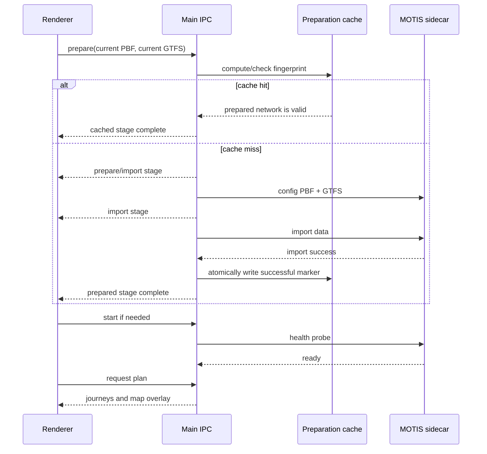

# Analysis Averages, MOTIS Readiness, and Station Search - Plan

> **For agentic workers:** REQUIRED SUB-SKILL: Use `superpowers:subagent-driven-development` (recommended) or `superpowers:executing-plans` to implement this plan task-by-task.

**Goal:** 0.9.0 최종 릴리스 전에 요일 평균의 정확성, 현행 MOTIS 경로탐색의 재사용성, 출발·도착 정류장 검색의 relevance를 보정한다.

**Architecture:** 분석 평균은 기존 일별 집계 결과에서 실제 유효 관측일 분모를 계산하도록 수정한다. MOTIS는 PBF·GTFS·실행환경 fingerprint로 준비된 네트워크를 재사용하고, main/preload/renderer 사이에 단계 상태를 전달한다. 정류장 picker는 외부 검색 라이브러리 없이 결정적인 이름·ID 유사도 점수로 후보를 정렬한다.

**Tech Stack:** TypeScript, React 19, Electron IPC, Vitest, Leaflet/MOTIS 기존 runtime.

**Spec:** 최근 실사용 테스트에서 확정된 세 가지 결함과 기존 0.9.0 계획의 독립 경로탐색 계약을 구현한다. 관련 기준선은 `docs/plans/2026-09-22-001-feat-station-scenario-workspace-plan.md`다.

## Global Constraints

- 0.9.0 후보의 원격 push와 최종 릴리스 승격 전에 이 계획의 release-blocking 범위를 닫는다.
- 기존 프로젝트의 `stationMaster`, `routeStopMaster`, 거래 원본은 직접 수정하지 않는다.
- PBF 자동 탐색·Geofabrik 안내·Leaflet 지도·현행 네트워크 경로탐색 계약은 유지한다.
- MOTIS cache hit가 안전하다고 판정되지 않으면 기존 전체 준비 경로로 되돌아간다.
- 검색 결과는 외부 서비스나 네트워크에 의존하지 않고 동일 입력에 대해 동일 순서를 반환한다.
- 이번 계획에서는 시나리오 편집기 전체와 데이터 입력 화면 전체의 구조 재설계를 하지 않는다.

## Review Focus

- 하루만 선택한 월요일에서 전체·주중 평균이 7일 또는 5일 기준으로 축소되지 않는지 검증한다.
- 동일한 PBF와 동일한 current GTFS로 두 번째 경로를 검색할 때 `config/import`가 다시 실행되지 않는지 검증한다.
- PBF 또는 GTFS fingerprint가 바뀌거나 cache marker가 불완전하면 오래된 네트워크를 재사용하지 않는지 검증한다.
- MOTIS 준비 중 화면이 비활성화처럼 보이지 않고 현재 단계와 다음 행동을 안내하는지 검증한다.
- 동일한 정류장 검색에서 정확 일치·접두어·부분 일치가 카탈로그 원래 순서보다 먼저 노출되는지 검증한다.

---

## Goal Capsule

- **Outcome:** 요일별 보고서의 일평균 수치가 선택된 실제 날짜 분모와 일치하고, MOTIS 경로탐색이 같은 네트워크를 매번 재생성하지 않으며, 출발·도착 정류장 후보가 이름·ID 유사도 순으로 정렬된다.
- **Authority:** 이 계획의 Product Contract와 현재 0.9.0 코드·테스트가 기준이다. 기존 0.9.0 계획과 충돌하면 이번 계획은 결함 보정에만 우선 적용하고 기존 기능 범위는 넓히지 않는다.
- **Stop conditions:** 평균 회귀 테스트, MOTIS cache hit/miss 및 진행상태 테스트, 검색 정렬 테스트가 통과하고 packaged smoke 및 native acceptance에서 실제 앱 흐름이 확인되어야 0.9.0 최종 push를 허용한다.
- **Execution profile:** 기존 dirty worktree의 0.9.0 변경을 보존한 상태에서, 아래 U-ID 순서대로 구현·검증한다.
- **Tail ownership:** 구현자는 Verification Contract와 Definition of Done을 충족한 뒤에만 릴리스 산출물과 원격 push를 판단한다.

## Product Contract

### Summary

이번 변경은 새로운 분석 종류나 새로운 경로탐색 제품을 만드는 일이 아니다. 현재 0.9.0 후보가 이미 제공하는 요일 분석과 독립 경로탐색을 실제 데이터로 사용할 때 드러난 정확성·대기상태·선택 UX 결함을 닫는다.

### Problem Frame

- `src/core/analysis.ts`는 요일별 일별 평균을 계산한 뒤 주중을 항상 5, 주말을 항상 2, 전체를 항상 7로 나눈다. 선택 기간이 하루이거나 일부 날짜만 포함할 때 화면과 저장된 `AnalysisResult`가 실제 일평균을 축소한다.
- 현재 프로젝트의 하루 데이터에서는 108,221명·선택일 1일인데 `overallAverage`가 15,460.14, `weekdayAverage`가 21,644.2로 기록되어 이 문제가 재현되었다.
- `src/renderer/RouteSearchWorkspace.tsx`는 검색마다 MOTIS를 중지하고 `src/main/motis-sidecar.ts`의 PBF `config`와 전체 `import`를 다시 실행한다. 287MB 수준의 전국 PBF에서는 검색 질의보다 준비 단계가 오래 걸린다.
- MOTIS 준비 단계는 하나의 Promise로 묶여 있고 화면에는 일반적인 대기 문구만 표시되어, 사용자는 비활성화·멈춤·실패를 구분할 수 없다.
- `src/renderer/ScenarioSearchPicker.tsx`는 이름·ID·보조 검색어의 단순 포함검색 후 카탈로그 순서로 최대 80개를 보여준다. 정확도나 유사도가 높은 후보가 먼저 오지 않는다.

### Requirements

- **R1 — 실제 날짜 분모:** `observed` 분석은 실제 유효 관측일을, `calendar` 분석은 선택한 달력 날짜를 분모로 사용한다. 주중·주말·전체 평균은 각 결과 객체와 화면 표시에서 같은 분모를 공유한다.
- **R2 — 평균 회귀 보장:** 하루·부분 주중·부분 주말·빈 데이터·기존 7일 데이터의 평균을 테스트로 고정한다.
- **R3 — MOTIS 준비 재사용:** 동일한 PBF, current GTFS, MOTIS 실행환경으로 준비된 네트워크가 있으면 `config/import`를 생략하고 기존 준비 결과를 재사용한다.
- **R4 — 안전한 무효화:** PBF, GTFS, MOTIS 실행환경, 준비 스키마 또는 준비 결과가 바뀌면 cache hit로 판정하지 않는다. 준비가 실패한 상태는 성공 cache로 기록하지 않는다.
- **R5 — 준비 상태 안내:** 경로 검색은 `준비 확인 → GTFS 준비 → 지도 네트워크 import → MOTIS 시작 → 경로 질의`의 현재 단계를 사용자에게 표시하고, 실패 시 사용자가 취할 수 있는 다음 행동을 설명한다.
- **R6 — 경로탐색 서버 유지:** cache hit이고 현재 MOTIS 서버가 ready이면 검색마다 서버를 중지하지 않는다. cache miss나 준비환경 변경 때만 재시작한다.
- **R7 — relevance 검색:** 정류장 후보는 정확한 이름·ID, 이름·ID 접두어, 토큰/부분 일치, 제한적인 유사 문자열 순으로 정렬하며 동점 순서는 결정적이어야 한다.
- **R8 — 검색 결과 표시:** 후보에는 기존 정류장명과 ID를 계속 표시하고, 검색 선택 결과는 현재 지도 endpoint와 출발·도착 상태를 그대로 동기화한다.
- **R9 — 기존 흐름 보존:** PBF 자동 탐색과 Geofabrik 안내, 지도 클릭 endpoint 선택, MOTIS 결과 지도 표시, 시나리오 편집기의 기존 picker 사용 흐름을 깨뜨리지 않는다.

### Acceptance Examples

- 2024-04-15 하루만 선택한 데이터에서 총 이용인원이 108,221명이면 전체 평균과 주중 평균도 108,221명으로 표시된다.
- 7일 전체가 선택된 기존 fixture에서는 현재 기대값과 동일한 주중·주말·전체 평균이 유지된다.
- 같은 PBF와 current GTFS로 연속 두 번 검색하면 두 번째 검색은 준비 marker를 확인하고 import 없이 서버를 재사용한다.
- PBF가 바뀌거나 current GTFS에 노선이 추가되면 기존 marker를 무효화하고 새 준비 단계를 표시한다.
- MOTIS import 중에는 사용자가 `MOTIS가 비활성화되었습니다`로 오해하지 않도록 현재 단계가 표시되고, PBF 부재·노선 데이터 부재·실행파일 오류는 각각 다른 안내를 보여준다.
- 검색어가 정류장명 또는 ID와 정확히 일치하면 해당 후보가 첫 번째이고, 동일한 부분 일치 후보는 이름·ID 유사도가 높은 순서로 정렬된다.

### Success Criteria

- 실제 하루 선택 결과의 `overallAverage`, `weekdayAverage`, 화면 callout, 보고서 요약이 모두 동일한 실제 일평균을 사용한다.
- 동일 네트워크 재검색에서 `config`와 `import`가 한 번만 실행되고, 변경된 fingerprint에서는 다시 실행된다.
- 준비 단계와 실패 원인이 renderer 화면과 테스트에서 확인된다.
- 정류장 후보 정렬이 `ScenarioSearchPicker`와 Route Search 양쪽에서 일관되며 기존 선택·지도 동기화가 유지된다.
- 전체 Vitest, typecheck, build, packaged smoke, native acceptance가 모두 통과한다.

### Scope Boundaries

#### In scope — 0.9.0 release-blocking correction

- 요일별 평균 분모 보정과 회귀 테스트.
- MOTIS 준비 결과 fingerprint cache, 서버 재사용, 준비 단계 상태 전달, 실행 불가 상태 안내.
- 이름·ID relevance 기반 정류장 후보 정렬과 현재 endpoint 선택 연동.
- 0.9.0 release note·README·native acceptance 기록 갱신.

#### Deferred to Follow-Up Work

- 정류장 검색의 전용 fuzzy-search 라이브러리 도입, 고급 초성 검색, 범위·지역 필터.
- picker의 완전한 arrow-key navigation과 최근 검색 history.
- 시나리오 지도 전체 UX 재설계, 데이터 Input 단계의 전체 정보구조 재편, 네이버·카카오·구글 수준의 대중교통 상세 결과 카드 확장.
- 여러 지역 PBF 동시 관리와 백그라운드 다운로드·자동 업데이트.

#### Outside this product's identity

- 외부 지도 서비스의 검색·경로 API를 제품의 경로탐색 엔진으로 대체하지 않는다.
- 사용자 원본 거래·정류장·노선 master를 자동으로 수정하거나 외부 서버에 업로드하지 않는다.

### Dependencies

- 현재 0.9.0 후보의 Leaflet route map, PBF resolver, synthetic GTFS builder, managed MOTIS IPC를 재사용한다.
- MOTIS 준비 cache는 기존 `motis-data` 디렉터리에 저장하되, 프로젝트 간 current GTFS가 섞이지 않도록 fingerprint를 포함해야 한다.
- native acceptance에는 실제 South Korea PBF와 앱에 포함된 Custom MOTIS artifact가 필요하다. PBF를 저장소에 추가하지 않는다.

### Sources / Research

- `src/core/analysis.ts`의 현재 분모 계산과 `tests/core/analysis.test.ts`의 7일 중심 coverage.
- `src/main/motis-sidecar.ts`, `src/main/motis-ipc.ts`, `src/renderer/RouteSearchWorkspace.tsx`의 현재 준비·시작·질의 흐름.
- `src/renderer/ScenarioSearchPicker.tsx`와 `tests/renderer/ScenarioSearchPicker.test.tsx`의 기존 포함검색 계약.
- `docs/plans/2026-09-22-001-feat-station-scenario-workspace-plan.md`의 0.9.0 지도 중심 경로탐색 계약.
- 외부 조사 없음. 이번 계획은 저장소의 기존 Leaflet, Electron IPC, MOTIS lifecycle 패턴을 기준으로 작성했다.

---

## Planning Contract

### Key Technical Decisions

- **KTD1 — 분모는 계산된 날짜 집합에서 도출한다:** `weekdayAverage`와 `weekendAverage`는 각각 실제 `counts` 합으로 나누고, `overallAverage`는 유효한 전체 날짜 집합의 총합으로 나눈다. 고정된 5·2·7 상수는 제거한다. `calendar`의 빈 날짜를 0으로 세는 기존 의미는 유지한다.
- **KTD2 — 준비 cache는 content fingerprint로 판정한다:** marker에는 PBF fingerprint, deterministic GTFS fingerprint, MOTIS 실행환경 identity, 준비 schema/options를 기록한다. 파일 존재 여부만으로 cache hit를 판정하지 않아 오래된 네트워크를 재사용하지 않는다.
- **KTD3 — 활성 fingerprint가 같은 경우에만 서버를 유지한다:** 디스크 marker가 유효하더라도 현재 IPC handler가 기억하는 실행 fingerprint와 다르면 서버를 중지한 뒤 준비된 네트워크를 다시 활성화한다. 같은 fingerprint의 준비 결과와 ready 서버만 유지하며, 준비 결과가 바뀌면 import 전에 서버를 중지하고 import 성공 후에만 marker를 교체한다.
- **KTD4 — 준비 진행은 indeterminate 단계 이벤트로 전달한다:** MOTIS CLI가 신뢰할 수 있는 전체 진행률을 제공하지 않으므로 가짜 퍼센트를 표시하지 않는다. 대신 준비·import·시작·질의 단계를 명확한 상태 이벤트로 전달한다.
- **KTD5 — 검색 relevance는 순수 결정 함수로 둔다:** 외부 검색엔진이나 fuzzy dependency 없이 정규화·정확일치·접두어·부분일치·유사 문자열 점수와 안정적인 tie-break를 사용한다. 기존 picker 소비자 전체가 같은 규칙을 공유한다.
- **KTD6 — 버전 경계는 0.9.0 최종화 전으로 고정한다:** 이번 세 이슈는 0.9.0에서 이미 노출된 분석 정확성과 핵심 경로탐색 사용성에 영향을 주므로 release-blocking으로 처리한다. 더 큰 입력·시나리오 UX 재설계는 후속 버전으로 미룬다.

### High-Level Technical Design

### Assumptions

- 기존 PBF resolver가 반환하는 SHA-256을 main-process cache key 계산의 기준으로 사용할 수 있거나, 동일한 값을 main에서 안전하게 재확인할 수 있다.
- MOTIS의 `config`와 `import` 성공 뒤 생성되는 `config.yml`·`data` 디렉터리를 준비 결과의 존재 증거로 사용할 수 있다.
- 현행 current GTFS 파일 집합은 키 순서와 무관하게 동일한 내용이면 동일한 fingerprint를 만들어야 한다.
- 정류장명과 ID만으로도 사용자가 제안한 1차 relevance 개선을 제공할 수 있다. ARS 번호·지역 필터는 현재 master 계약에 없으므로 이 계획에서 추정하지 않는다.

### Sequencing

1. U1에서 데이터 정확성을 고정한다.
2. U2에서 main-process 준비 cache와 무효화 계약을 만든다.
3. U3에서 IPC 진행상태와 Route Search 화면의 cache-aware lifecycle을 연결한다.
4. U4에서 공통 정류장 picker relevance와 endpoint 검색 결과를 보정한다.
5. U5에서 문서·packaged smoke·native acceptance를 갱신하고 0.9.0 최종화 여부를 판단한다.

### Risks & Dependencies

- MOTIS data directory가 기존 실행 결과와 섞여 있을 수 있으므로 marker가 없거나 JSON이 손상된 경우 반드시 cache miss로 처리해야 한다.
- cache miss 중 앱이 종료되면 성공 marker가 남지 않아 다음 실행에서 안전하게 재생성되어야 한다.
- 다른 MOTIS 소비자도 같은 managed sidecar를 사용하므로 Route Search 최적화가 scenario execution의 stop/start 순서를 깨뜨리지 않는지 확인해야 한다.
- 공통 picker relevance 변경은 신규 노선·기존 노선 편집 화면의 결과 순서도 바꾸므로 해당 화면의 기존 선택 callback과 중복 방지 동작을 보존해야 한다.
- 전국 PBF import 시간은 환경별 편차가 크므로 이번 계획의 성능 기준은 절대 시간보다 동일 fingerprint에서 재import가 발생하지 않는다는 관찰 가능한 계약으로 둔다.

---

## Implementation Units

### U1. Correct observed-day and calendar-day averages

**Goal:** 선택 기간과 분모 모드에 맞는 전체·주중·주말 일평균을 계산한다.

**Requirements:** R1, R2.

**Dependencies:** 없음.

**Files:**
- Modify: `src/core/analysis.ts`
- Test: `tests/core/analysis.test.ts`

**Approach:** 기존 `totals`와 `counts`를 유지하고, 그룹별 유효 날짜 수를 집계한 뒤 그룹 평균과 전체 평균에 각각 적용한다. `metrics[*].observedDays`, `selectedDays`, 기존 calendar zero-fill 의미와 percent 계산을 불필요하게 변경하지 않는다. 보고서와 화면은 이미 `AnalysisResult`의 평균 필드를 사용하므로 별도 표시 수식을 복제하지 않는다.

**Patterns to follow:** `analyzeDailyTotals`의 observed/calendar 분기와 기존 7일 fixture 테스트.

**Execution note:** 기존 평균 계산은 사용자에게 보이는 수치의 기반이므로, 부분 기간 characterization 테스트를 먼저 추가한 뒤 계산식을 변경한다.

**Test scenarios:**

- 2024-04-15 월요일 하루에 108,221명이 있으면 `overallAverage`와 `weekdayAverage`가 108,221이고 `weekendAverage`가 0이다.
- 월요일과 화요일만 있는 observed 데이터는 두 날짜 합계를 2로 나누고 주말을 분모에 포함하지 않는다.
- 월요일부터 금요일까지의 calendar 범위에서 일부 날짜 데이터가 없어도 선택된 5일을 분모로 사용한다.
- 기존 7일 fixture의 metrics, percent, overallAverage가 현재 기대값과 동일하다.
- 빈 데이터와 유효하지 않은 날짜가 섞인 경우 0으로 나누지 않고 기존 warning 계약을 유지한다.

**Verification:** 부분 기간 결과를 직접 확인했을 때 화면 callout과 report summary가 동일한 `AnalysisResult.overallAverage`를 사용한다.

### U2. Add fingerprinted MOTIS preparation reuse

**Goal:** 동일한 current network를 두 번째 검색에서 재import하지 않고, 변경·손상·실패 상태는 안전하게 재생성한다.

**Requirements:** R3, R4, R6.

**Dependencies:** U1은 독립이며, U3가 소비할 준비 결과 계약을 이 단위가 제공한다.

**Files:**
- Create: `src/main/motis-preparation-cache.ts`
- Modify: `src/main/motis-sidecar.ts`
- Modify: `src/main/motis-ipc.ts`
- Test: `tests/main/motis-preparation-cache.test.ts`
- Test: `tests/main/motis-sidecar.test.ts`
- Test: `tests/main/motis-ipc.test.ts`

**Approach:** 순수 fingerprint builder와 marker reader/writer를 별도 모듈로 두고, marker write는 `config`와 `import`가 모두 성공한 뒤 atomic replace로 수행한다. fingerprint는 PBF identity, 파일명 순서에 독립적인 GTFS content hash, MOTIS binary/runtime identity, preparation schema/options를 포함한다. IPC handler는 디스크 marker와 현재 활성 fingerprint를 모두 비교한다. 두 값이 같으면 `prepareMotisData`를 호출하지 않고 준비된 options를 기억하며, 디스크 hit라도 활성 fingerprint가 다르면 sidecar를 중지한 뒤 준비된 네트워크를 활성화한다. cache miss이면 필요할 때만 sidecar를 중지하고 기존 `prepareMotisData`를 실행한다. cache marker가 없거나 손상되거나 data/config 증거가 없으면 miss로 취급한다.

**Patterns to follow:** `src/main/motis-runtime.ts`의 managed defaults, `src/main/motis-sidecar.ts`의 lifecycle queue와 기존 `MotisPreparationResult` 계약.

**Technical design:** 준비 결과 marker는 성공한 fingerprint와 생성 artifact 경로만 기록한다. 현재 cache가 어떤 프로젝트에서 생성됐는지 모호하지 않도록 GTFS content hash를 반드시 포함한다. cache hit 결과는 renderer가 상태 문구를 만들 수 있도록 `cacheHit`와 fingerprint 식별 정보를 제공하되, raw PBF·GTFS content는 반환하지 않는다.

**Test scenarios:**

- 동일한 PBF·GTFS·runtime 입력에서 marker가 유효하면 `config/import` runner가 호출되지 않고 cache hit 결과가 반환된다.
- GTFS 파일 하나의 content가 바뀌면 cache miss가 되고 두 명령이 순서대로 다시 실행된다.
- PBF fingerprint, MOTIS runtime identity, preparation option 또는 schema가 바뀌면 cache miss가 된다.
- marker JSON이 손상되었거나 `config.yml`·`data` 증거가 없으면 cache hit로 처리하지 않는다.
- import 중 runner가 실패하면 성공 marker를 만들지 않고 다음 요청이 재시도 가능하다.
- cache miss 또는 디스크 hit와 현재 활성 fingerprint 불일치에서는 import/활성화 전에 sidecar가 중지되고, 두 fingerprint가 같은 cache hit에서만 ready sidecar가 유지된다.
- renderer가 전달한 임의의 executable path·data directory·환경변수는 기존처럼 무시되고 managed defaults만 사용된다.

**Verification:** 같은 fingerprint의 연속 prepare가 import runner 호출 횟수를 증가시키지 않고, 서로 다른 fingerprint의 prepare가 이전 marker를 안전하게 대체한다.

### U3. Surface preparation stages and make Route Search cache-aware

**Goal:** 사용자가 MOTIS가 무엇을 하고 있는지 알 수 있고, 준비된 네트워크를 실제 질의에 즉시 재사용하도록 화면 lifecycle을 바꾼다.

**Requirements:** R5, R6, R9.

**Dependencies:** U2.

**Files:**
- Modify: `src/shared/types.ts`
- Modify: `src/main/motis-ipc.ts`
- Modify: `src/main/index.ts`
- Modify: `src/preload/index.ts`
- Modify: `src/renderer/env.d.ts`
- Modify: `src/renderer/RouteSearchWorkspace.tsx`
- Modify: `src/renderer/styles.css`
- Test: `tests/main/motis-ipc.test.ts`
- Test: `tests/preload/motis-boundary.test.ts`
- Test: `tests/renderer/RouteSearchWorkspace.test.tsx`

**Approach:** `MotisPreparationProgress`를 shared type으로 정의하고 main에서 `checking`, `building`, `importing`, `starting`, `querying`, `ready`, `failed` 같은 indeterminate 단계 이벤트를 보낸다. preload는 기존 listener cleanup 패턴으로 renderer에 노출한다. Route Search는 검색마다 무조건 `stopMotis`하지 않고, U2의 preparation result와 현재 `MotisStatus`를 기준으로 필요한 경우에만 재시작한다. 검색 버튼 주변에는 route data/PBF/MOTIS runtime의 준비 여부와 다음 행동을 명시하고, busy 중에는 동일 요청 중복만 막는다.

**Patterns to follow:** `src/renderer/App.tsx`와 `src/renderer/ScenarioJourneyComparison.tsx`의 `role="status"` progress UI, `src/preload/index.ts`의 IPC boundary, `src/main/motis-sidecar.ts`의 ready/stopped lifecycle.

**Execution note:** 실제 전국 PBF를 import하는 native smoke 전에는 fake progress/event test로 IPC 계약을 고정한다. MOTIS CLI가 정확한 퍼센트를 제공하지 않으므로 UI에 임의의 백분율을 표시하지 않는다.

**Test scenarios:**

- prepare 단계가 renderer listener에 cache 확인·import·ready 이벤트를 순서대로 전달한다.
- prepare 또는 start가 실패하면 failed 이벤트와 actionable message가 전달되고 busy 상태가 해제된다.
- PBF가 없거나 route feed가 비어 있으면 버튼 또는 인접 안내가 원인과 다음 행동을 설명하며 silent disabled 상태가 되지 않는다.
- 같은 네트워크로 두 번 검색하면 두 번째 검색에서 stop/import 없이 start 또는 기존 ready server 재사용 후 plan query를 수행한다.
- 다른 네트워크가 먼저 실행된 뒤 디스크 cache hit 네트워크를 선택하면 기존 서버를 중지하고 올바른 활성 fingerprint로 전환한다.
- PBF가 stale/missing이면 기존 Geofabrik 안내·재탐색·고급 fallback이 유지되고 검색 실행 오류가 명확하다.
- endpoint 선택, 지도 marker, 시간 preset, 결과 overlay는 preparation progress 추가 후에도 기존 계약대로 렌더링된다.
- preload listener가 unsubscribe 된 뒤 renderer unmount 시 중복 progress callback을 남기지 않는다.

**Verification:** packaged app에서 첫 검색은 단계별 상태를 보여주고, 같은 current network의 두 번째 검색은 준비 단계를 즉시 cache hit로 통과하며, 실패 상태에는 사용자가 재시도할 수 있는 문구가 표시된다.

### U4. Rank station search results by name and ID relevance

**Goal:** 출발·도착 및 시나리오 정류장 picker가 지도 앱처럼 가장 관련성 높은 후보를 먼저 보여준다.

**Requirements:** R7, R8, R9.

**Dependencies:** U3와 병렬 구현 가능하지만 Route Search endpoint 선택 계약을 보존해야 한다.

**Files:**
- Create: `src/core/scenario-search.ts`
- Modify: `src/renderer/ScenarioSearchPicker.tsx`
- Modify: `src/renderer/RouteSearchWorkspace.tsx`
- Test: `tests/core/scenario-search.test.ts`
- Test: `tests/renderer/ScenarioSearchPicker.test.tsx`
- Test: `tests/renderer/RouteSearchWorkspace.test.tsx`

**Approach:** 검색어와 label/value/meta/searchText를 같은 정규화 규칙으로 비교하는 순수 scoring helper를 만든다. 정확한 ID·정류장명, ID·이름 접두어, 토큰·부분 일치, 제한적인 문자열 유사도를 점수화하고 점수·짧은 label·원래 index 순으로 안정 정렬한다. 빈 query에서는 기존 카탈로그 순서와 80개 제한을 유지한다. 후보 markup은 이름과 ID를 계속 함께 보여주고, 선택 callback과 endpoint/map sync는 변경하지 않는다.

**Patterns to follow:** 현재 `ScenarioSearchOption` 계약, `ScenarioSearchPicker`의 listbox markup, `RouteSearchWorkspace`의 `stationById`와 `selectStation` 동기화.

**Test scenarios:**

- 정확한 정류장 ID 검색은 다른 이름 부분 일치보다 해당 ID를 첫 번째로 보여준다.
- 정확한 정류장명 검색은 이름 접두어·부분 일치 후보보다 해당 정류장을 먼저 보여준다.
- 대소문자·공백 차이를 정규화하고, 이름·ID·searchText 각각의 일치를 검색한다.
- 같은 점수의 후보는 입력 배열 순서를 유지해 결과가 매번 바뀌지 않는다.
- 빈 query는 기존 순서를 유지하고 80개 제한을 넘기지 않는다.
- 결과가 없으면 기존 empty state를 유지한다.
- Route Search에서 검색 결과를 선택하면 origin/destination endpoint와 지도 marker가 같은 station ID로 갱신된다.
- 신규 노선·기존 노선 scenario picker에서 검색 정렬만 바뀌고 추가·삭제 callback 및 clearAfterSelect 동작은 유지된다.

**Verification:** 실제 정류장 catalog에서 짧은 이름·ID query를 입력했을 때 사용자가 첫 몇 개 후보만 확인해 원하는 정류장을 선택할 수 있고, 선택 결과가 MOTIS query endpoint와 동일하다.

### U5. Re-verify the 0.9.0 candidate and update release evidence

**Goal:** 세 결함 보정이 0.9.0 native acceptance와 packaged smoke의 release evidence에 반영되도록 한다.

**Requirements:** R1–R9, Success Criteria.

**Dependencies:** U1, U2, U3, U4.

**Files:**
- Modify: `README.md`
- Modify: `CHANGELOG.md`
- Modify: `docs/releases/0.9.0.md`
- Create or update: `docs/test-reports/2026-09-22-v0.9.0-feedback-correction.md`

**Approach:** 문서에는 실제 동작 계약만 기록한다. 평균 분모, cache reuse/invalidation, 단계별 MOTIS 안내, relevance picker를 0.9.0 acceptance 항목으로 추가하고, 이전 native acceptance 기록과 새 결과를 혼동하지 않도록 별도 correction report에 실행 시각·artifact·PBF fingerprint·검증 범위를 남긴다.

**Test expectation:** 문서 단위 자체의 단위 테스트는 만들지 않는다. 대신 Verification Contract의 packaged smoke와 native acceptance 결과가 문서의 근거가 되어야 한다.

**Verification:** correction report가 U1–U4의 테스트 결과와 실제 앱에서 확인한 첫 검색·재검색·평균·검색 후보 순서를 각각 연결한다. 미충족 항목이 있으면 0.9.0 최종 push를 보류한다.

---

## Verification Contract

### Automated gates

- `npm run typecheck`
- `npm test`
- `npm run build`
- `npm run package:win`
- `npm run test:packaged-smoke`
- 기존 release readiness 검증은 Custom MOTIS attestation 조건을 포함해 실행하고, 외부 artifact가 없으면 성공으로 포장하지 않는다.

### Native acceptance gates

- 하루만 선택한 실제 프로젝트에서 요일별 화면·report summary의 평균이 총 이용인원과 일치한다.
- PBF 자동 탐색 완료 후 첫 MOTIS 검색에서 준비 단계가 보이고, 동일 current network로 두 번째 검색 시 cache hit와 빠른 질의가 확인된다.
- PBF가 없는 임시 환경에서 Geofabrik 안내와 다시 찾기가 동작하고, 앱이 무한 대기 상태가 되지 않는다.
- 출발·도착 정류장 검색에서 정확 ID·정류장명·부분 이름을 각각 입력해 relevance 순서와 지도 marker 동기화를 확인한다.
- MOTIS 경로 결과가 기존처럼 지도 overlay·경로 카드·대안 선택과 함께 표시된다.

### Regression surface

- 7일 전체 평균, 시간대 평균, 정류장·OD 분석, scenario picker, scenario GTFS/MOTIS 흐름을 기존 fixture로 재확인한다.
- PBF resolver, MOTIS local request boundary, managed executable/data directory 보안 계약을 재확인한다.

## Definition of Done

- [ ] U1–U4의 구현과 명시된 테스트 시나리오가 완료되었다.
- [ ] 동일 MOTIS fingerprint에서 `config/import` 중복 실행이 제거되고, 변경·손상 상태는 안전하게 재생성된다.
- [ ] 준비 단계와 실패 원인이 native 화면에서 확인 가능하다.
- [ ] 실제 하루 분석의 전체·주중 평균이 올바르며 기존 7일 결과는 회귀하지 않는다.
- [ ] 정류장 검색 relevance와 endpoint/map 동기화가 확인된다.
- [ ] U5의 README, CHANGELOG, release note, correction report가 실제 검증 결과와 일치한다.
- [ ] typecheck, full test, build, packaged smoke가 통과한다.
- [ ] native acceptance에서 PBF 자동 준비, 첫 검색, 동일 네트워크 재검색, PBF 부재 안내를 확인한다.
- [ ] 실험·실패한 접근의 dead code, 임시 marker, stale build artifact가 diff에 남아 있지 않다.
- [ ] 위 조건이 모두 충족되기 전에는 0.9.0 원격 push와 최종 릴리스 승격을 완료로 보고하지 않는다.
